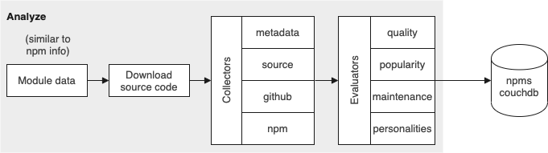

# Architecture

`npms-analyzer` is a CLI application which must be run several times with varying parameters in order to generate and maintain an [Elasticsearch](https://www.elastic.co/downloads/elasticsearch) index of npm packages.

Three of the commands ([observe](#the-observe-command), [consume](#the-consume-command) and [scoring](#the-scoring-command)) run continuously while the [tasks command](#the-tasks-command) performs tasks which exit on completion. Two of the tasks should be run at regular intervals (e.g. cron) while the others are utilities that can be manually run if needed.

Data generated by `npms-analyzer` that will be needed in the future is held within the [CouchDB](http://couchdb.apache.org/)] `npms` database. This consists of:
- an `analysis` of each package that is generated the [consume command](#the-consume-command) (this is used by the [scoring command](#the-scoring-command))
- an `aggregation` (stats about our entire collection of packages) generated by the [scoring command](#the-scoring-command) (this is used by the [consume command](#the-consume-command))

There is also a [RabbitMQ](https://www.rabbitmq.com/download.html) message queue into which the [observe command](#the-observe-command) submits requests for the [consume command](#the-consume-command) to process a package. The benefits of using a queue for this are:
- Burst protection
- No loss of packages on crashes or failures
- Automatic retries
- Multiple instance of the [consume command](#the-consume-command) can be run from any host with access to the queue

## The Observe Command

The `observe command` spawns two continuously running `observers`:
 - the `realtime` observer follows the [CouchDB](http://couchdb.apache.org/) `npm` feed and, having filtered out changes not related to publishing (e.g. staring), it adds the changed packages to the [RabbitMQ](https://www.rabbitmq.com/download.html) queue to be processed by the [consume](#the-consume-command) command.

   Items are added to the queue with a priority of `1` to ensure that they are processed as quickly as possible.
 - the `stale` observer repeatedly calls the [stale-packages view in couchdb](config/couchdb/npms-analyzer.json). It first iterates over the packages keyed `failed` by the view and then over those keyed `normal`. It filters out packages which are not not old enough (< 12 hours for failed and < 25 days for normal) before adding them to the queue.

   Items are added with a priority of `0` to ensure that they do not hold up processing of newly published packages.

There should be only one instance of the `observe command` running at a time.

## The Consume Command

The `consume command` monitors the queue and processes packages that have been added to the queue. It processes packages in parallel with a default concurrency of `5`. It [analyzes](#analysis-of-queued-packages) and then [scores](#scoring-of-queued-packages) each package.

Multiple instances of the `consume command` can be run at a time.

### Analysis of a queued Package

The `analysis` of a package involves:

1. Fetch the package data
1. Download the source code
1. Run the [Collectors](#collectors) to generate `collected data`
1. Run the [Evaluators](#evaluators) to generate a collection of scalar values from the `collected data`
1. Group the [Evaluators](#evaluators)' value collections together in an `evaluation`
1. Store the `collected data` and the `evaluation` in the [CouchDB](http://couchdb.apache.org/) `npms` database

#### Collectors

The collectors are responsible for gathering useful information about each package from a variety of sources:

##### Metadata Collector

The metadata collector extracts basic data and attributes of a package.

- Extract package name, scope, version, description and keywords
- Extract package author, publisher, maintainers and contributors
- Extract the license
- Get releases timing information
- Extract repository and homepage
- Extract README
- Extract the package dependencies
- Check if the package is deprecated
- Check if the package has a test script
- Check if the package contains "selective files" ([whatever they are...??](https://github.com/npm/npms-analyzer/tree/7f87c858d3ae77a587725d93f05597548232c3e5/lib/analyze/collect/metadata.js#L322))

##### Source Collector

The source collector digs into the source code.
- Check certain files: `.npmignore`, `.gitignore`, `.gitattributes`, README size, tests size, etc
- Detect linters, such as `eslint`, `jshint`, `jslint` and `jscs`
- Detect badges in the README
- Grab the code coverage %
- Get dependencies insight, including if they are outdated
- Get security insight with node security project

##### GitHub Collector

The github collector uses GitHub to collect useful data and statistics present there.

- Extract the homepage
- Get number of stars, subscribers and forks
- Fetch the number of issues/pull requests and their distribution over time
- Fetch contributors
- Fetch the repository activity in terms of commits
- Check the build status

This collector is susceptible to the GitHub [rate limit](https://developer.github.com/v3/rate_limit/) policy. To fight against this limit, several GitHub keys should be specified in the config. [token-dealer](https://github.com/moxystudio/node-token-dealer) is used to cycle through the keys and, when a key is rate limited, to remove it from the pool until it's ban will be lifted and to retry the request with a different key.

##### npm

The npm collector obtains data from [CouchDB](http://couchdb.apache.org/) views and the [redis-download-counts](https://github.com/npm/redis-download-counts) API.

- Get number of stars
- Get number of downloads over the previous 1, 7, 30, 90, 180 & 365 days
- Get number of dependents

#### Evaluators

The evaluators generate scores for a package based on the data collected for the package. There are evaluators for each of the three components in a PQM score:

##### Popularity

The `Popularity Evaluator` calculates the following scores:
- `community interest` - a sum of:
  - number of github and npm stars
  - number of github forks
  - number of github subscribers
  - number of github contributors
- `downloads count` - the average 30 day downloads over the previous 90 days
- `downloads acceleration` - a weighted sum of average daily download increase/decrease over the following periods:
  - previous 30 days vs previous 90 days (25%)
  - previous 90 days vs previous 158 days (25%)
  - previous 180 days vs previous 365 days (50%)
- `dependents count`
  - How many packages depend upon this package?

##### Quality

The `Quality Evaluator` calculates the following scores:
- `carefulness` - a complex calculation based upon:
  - Has README? Has changelog? Has license? Has .gitignore and friends?
  - Is the version stable (> 1.x.x)? Is it deprecated?
  - Does the project have linters configured?
- `tests` - calculated as a weighted sum of:
  - Has tests? (60%)
  - Is build passing? (25%)
  - Coverage percentage (15%)
- `health` - a complex calculation based upon:
  - Has outdated dependencies?
  - Do they have vulnerabilities?
  - Has locked down dependency versions or loose versions (`*`, `>= 1.6.0`, etc)?
- `branding` - calculated as a weighted sum of:
  - Has custom website? (40%)
  - Has badges? (60%)

##### Maintenance

The `Maintenance Evaluator` calculates the following scores:
- `releases frequency` - a complex calculation based upon the number of releases in the previous 30, 90, 180, 365 and 730 days
- `commits frequency` - a complex calculation based upon the number of releases in the previous 30, 180 and 365 days
- `open issues` - a complex calculation based upon the number of issues and how many are open
- `issues distribution` - a complex calculation based upon how long issues were open before being closed (not sure if this also includes the age of open issues)

If a package is "finished" (`version` >= `1.0.0`, not deprecated, has < 15 issues, has README, has tests) then each of the scores gets increased to 0.9 if they are below that.

### Scoring of a queued Package

The scoring of a queued package involves calculating it's score based upon:
 - the package's `evaluation`
 - the `aggregation` (stored in the [CouchDB](http://couchdb.apache.org/) `npms` database by the [scoring command](#the-scoring-command)) and storing that score in [Elasticsearch](https://www.elastic.co/downloads/elasticsearch)

If there is no `aggregation`, the  [consume command](#the-consume-command) does not score the package but the package will later be scored by the [scoring command](#the-scoring-command) once it has generated the `aggregation`.

Calculating the score and storing it in [Elasticsearch](https://www.elastic.co/downloads/elasticsearch) is performed by the [`score module`](#the-score-module)'s default function.

## The Scoring Command

The name of the `scoring command` is misleading, `aggregation-re-generation-and-re-scoring-and-index-management command` would be more insightful, if perhaps a little verbose.

The `scoring command` first checks the timestamp part of the [Elasticsearch](https://www.elastic.co/downloads/elasticsearch) index name that the `npms-current` alias points at. If necessary, the command idles until the index is of they age specified by the `cycle-delay` argument (defaults to 3 hours).

The `scoring command` then performs the following:

 - `Prepare`
   - Creates a new index in [Elasticsearch](https://www.elastic.co/downloads/elasticsearch) and points the `npms-new` alias at it
   - removes any other indices except for the one the `npms-current` alias points at.
 - `Aggregate`
   - Gets the evaluations of all packages and generates an `aggregation` (min/max/mean/median values for each of the scores in the evaluations)
   - Stores the `aggregation` in [CouchDB](http://couchdb.apache.org/) where it will be used by the  [consume command](#the-consume-command).
 - `Score module`
   - Calls the [`score module`](#the-score-module)'s `all` function to (re-)generate scores for all packages based upon the `aggregation`.
 - `Finalize`
   - Points the `npms-current` alias at the new index and deletes the old index.

Having performed the above, the `scoring command` waits for the period specified by the `cycle-delay` argument before repeating the process.

## The Tasks Command

The `tasks command` provides the following actions:

### check-gh-tokens

This task:
- makes calls to https://api.github.com/user using the each of the tokens specified in the config to determine if it's valid
- prints the count of (in)valid as well as the value of any invalid tokens

### clean-extraneous

*should be run on a schedule (e.g. cron)*

Removes packages from the [CouchDB](http://couchdb.apache.org/) `npms` database that do not exist in the [CouchDB](http://couchdb.apache.org/) `npm` database.

### enqueue-missing

**Warning: don't use this command until we understand it better and have updated the docs below**

*should be run on a schedule (e.g. cron)*

This command finds packages which exist in the [CouchDB](http://couchdb.apache.org/) `npm` database that do not exist in the [CouchDB](http://couchdb.apache.org/) `npms` database and adds them to the [RabbitMQ](https://www.rabbitmq.com/download.html) queue.

While the documentation for this task suggests that packages could be missing due to a repeated transient issue while the `consume` command is attempting to process a package, the `consume` command actually stores an empty `analysis` in the `npms` database.

I speculate that this command is intended to deal with packages that the `consume` command was unable to store the analysis for due to [CouchDB](http://couchdb.apache.org/) unavailable.

I worry that this command would also identify packages which have been/will be added to the queue by the [observe command](#the-observe-command) for the  [consume command](#the-consume-command) will deal with in the future. While this would lead to the package being processed twice by the  [consume command](#the-consume-command), this is probably not a serious issue as long as the `enqueue-missing` command is not run too regularly.

### enqeue-view

Adds the packages returned by the specified view in the [CouchDB](http://couchdb.apache.org/) `npms` database to the [RabbitMQ](https://www.rabbitmq.com/download.html) queue.

### migrate

Looks like it loads each package in the [CouchDB](http://couchdb.apache.org/) `npms` database and creates/updates a property within the `collected data` with a value extracted from another property in the `collected data`.

I guess this was run once when the  [consume command](#the-consume-command) was modified to include an additional property and the existing data in `npms` needed to have it added.

Presumably the code has been left here ready for modification in case a similar change is made in the future.

### process-package

Analyzes a package and passes the `analysis` to the [scoring module](#the-scoring-module)'s default function for score calculation and storage in the `npms-new` and `npms-current` [Elasticsearch](https://www.elastic.co/downloads/elasticsearch) indices.

### re-evaluate

Iterates over all packages in the [CouchDB](http://couchdb.apache.org/) `npms` database and re-generates their `evaluation`. The packages will be re-scored when the  [scoring command](#the-scoring-command) cycles.

### re-metadata

Iterates over all packages in the [CouchDB](http://couchdb.apache.org/) `npms` database and re-generates the `metadata` part of their `collected data`. It's probably necessary to follow this by running the `re-evaluate` task to regenerate their `evaluation`s. The packages will then be re-scored when the  [scoring command](#the-scoring-command) cycles.

## The Scoring Module

The `scoring module` provides the following functions:

 - default function - calculates a `score` for a single package and stores it in the `npms-new` and `npms-current` [Elasticsearch](https://www.elastic.co/downloads/elasticsearch) indices
 - `all` - calculates a `score` for every package in the [CouchDB](http://couchdb.apache.org/) `npms` database and stores it in the `npms-new` and `npms-current` [Elasticsearch](https://www.elastic.co/downloads/elasticsearch) indices
 - `save` - saves a `score` in the `npms-new` and `npms-current` [Elasticsearch](https://www.elastic.co/downloads/elasticsearch) indices. *Despite being exported, this is not used outside of the module*
 - `remove` - removes a `score` in the `npms-new` and `npms-current` [Elasticsearch](https://www.elastic.co/downloads/elasticsearch) indices. This is called by the `consume` command when processing a package that it cannot find in the [CouchDB](http://couchdb.apache.org/) `npm` database.

### The Scoring Calculation

The `score` generated by the default and `all` functions contains all data required by the search system:

 - Package metadata: `name`, `scope`, `version`, `description`, `keywords`, `date`, `links`, `author`, `publisher`, and `maintainers`
 - Flags: `deprecated`, `insecure`, `unstable`
 - The `evaluation`
 - The `score` values: PQM scores and a final score which is a weighted sum of:
   - `popularity` (35%)
   - `quality` (30%)
   - `maintenance` (35%)

The PQM scores for each of the sub-values of an `evaluation`'s PQM (e.g. `carefulness`, `tests`, `health` and `branding` for `Quality`) are calculated as follows:
- The `evaluation` value is normalized with the associated `mean` value in the `aggregation` using the associated `min` and `max` values.
- A Bezier Curve is computed using 4 control points: (0, 0), (normalizedAggregationMean, 0.75), (normalizedAggregationMean, 0.75), (1, 1).
- The score is the Y value that corresponds, in this curve, to the package evaluation (X axis)

  

